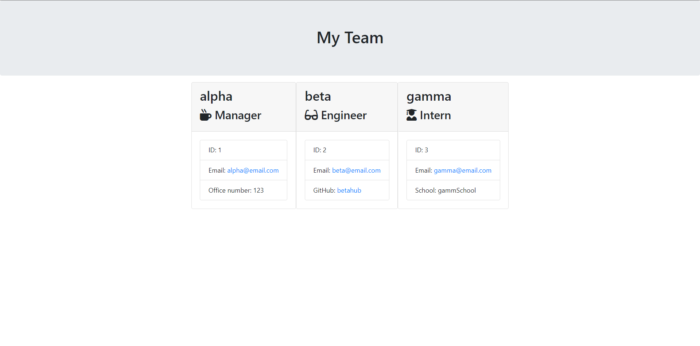

# Employee Team Builder

# Table Contents

- [Project Summary](#Summary)
- [Installation Instructions](#Instructions)
- [Questions](#Questions)
- [Github](#Repo)
- [Screenshot](#Deployed)
- [Video](#VideoDemo)

# Project Summary

This app demonstrates the Employee portfolio builder using the NODE.js CLI. The user here is prompted with the questions about the employee info and the role he is playing in the team.

# Installation Instructions:

Install all the required npm modules such as: inquirer, jest and email-validator. run 'node index.js' to start the application.

# Questions:

Any questions regarding this project can be directed at me via:

- [Github Profile](https://github.com/romzzp)
- [Email Address](romzz.patel@gmail.com)

# Github:

- [Repo](https://github.com/romzzp/EmployeeTeamBuilder)

# Screenshot:

# Video

https://watch.screencastify.com/v/iPismrPAWFdhiK3iG16A
